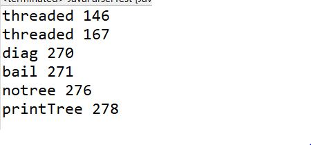
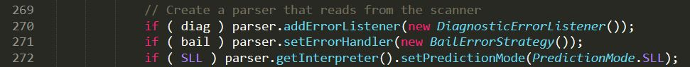
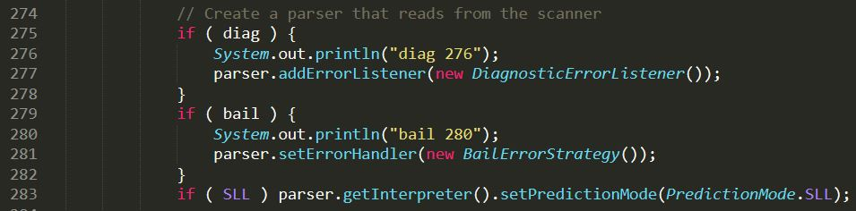

# ANTLR-application
Assignment 1 of course CS7301

Refer to https://o2lab.github.io/710/p/a0.html for assignment steps

**Part 0: Getting Started**

Windows ANTLR setup:
Download https://www.antlr.org/download/antlr-4.9-complete.jar.
Add antlr4-complete.jar to CLASSPATH, either:
Permanently: Using System Properties dialog > Environment variables > Create or append to CLASSPATH variable
Temporarily, at command line:
SET CLASSPATH=.;C:\Javalib\antlr4-complete.jar;%CLASSPATH%
Create batch commands for ANTLR Tool, TestRig in dir in PATH
 antlr4.bat: java org.antlr.v4.Tool %*
 grun.bat:   java org.antlr.v4.gui.TestRig %*

Add antlr4-complete.jar to CLASSPATH in Eclipse
Note: If you are unable to create batch commands use java org.antlr.v4.Tool instead of antlr4.bat and java org.antlr.v4.gui.TestRig instead of grun.bat
Check : https://www.antlr.org/

**Part 1: Playing with Java Grammar and Parser**

Follow along section
Replace Java with Java8 if the links don't work

**Part 2: Finding Interesting Program Facts through Parsing**

Use ANTLR to find boolean variables with length less than 3 and which do not have '!' sign with it.
Files:
  1. JavaParserTest.java
  2. Test.java (Place it in the same directory)
  
JavaParserTest reads Test.java and finds boolean variables satisfying above criteria and displays their name and line number.

**Part 3: Rewrite Program Source Code with Parser**

Insert Print Statements for boolean variables and line number.
Here, the challenges are:
    - Maintain line number while editing Test.java file 
    - Inserting braces appropriately
    - Indentation should be preserved

All 3 challenges were accomplished

Files:
  1. PrintBoolean.java
  2. Test.java (Place it in the same directory)
  
The updated program from Test.java is written to BooleanOutputPrinted.java

This is a part of the output from BooleanOutputPrinted.java

In Test.java

In BooleanOutputPrinted.java

